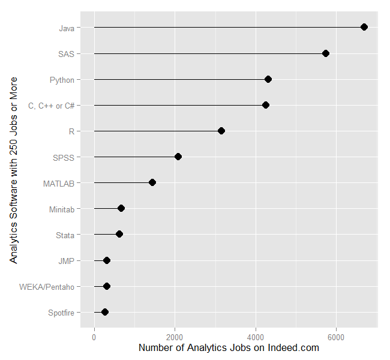
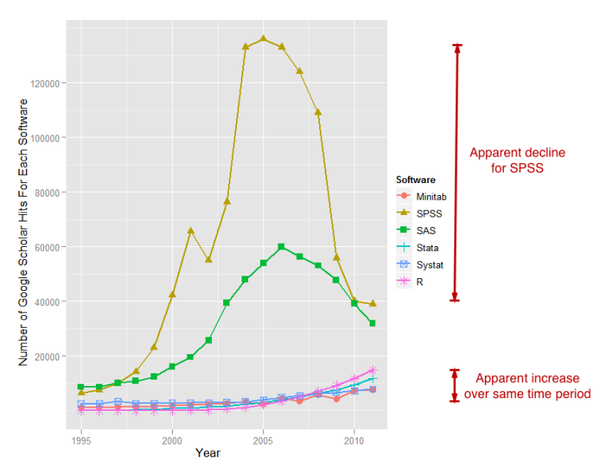

# Introduction to R, R Studio and Literate Programming

--- &twocol 

## I Very Brief History Of R  

*** {name: left}

- **_S_** language (1976)
  - Developed in Bell Labs
  - An Alternative to **_Fortran_** Routines
- **_R_** Language
  _ Derived from **_S_** and **_Scheme_** (1993)
  - Open Source under the Free Software Foundation's GNU general license (1995)

*** {name: right}

  

--- &twocol 

## R Popularity Is Increasing

*** {name: left}
  
  

*** {name: right}

  

--- &twocol

## Literate Programming

*** {name: left}

  

  
*** {name: right}

  - Introduced by Donald Knuth (1992)
  - Exisited before that in Mathematica
  - Explanation of program logic in text
  - Code follows the structure of the document
    - The reverse (document follows the code) is documentation
      

--- &twocol

## Reproducible Research

*** {name: left}

### Reproducible Results (Local)
  
  - The analyses should be fully reprocible
  - Data and codes are available
  - Sufficient documentation
  - Sufficient context
    
*** {name: right}

### Reproducible Science (Global)
  
  - The research can be replicated
    - Any Researcher
    - Within domain of the results
  - Cornerstone of science

--- 

## Reprocible Results

 - Incorporate literate programming
 - Borrows heavily from software development
 - Expands our idea of data
 - Expands our idea of publishing

